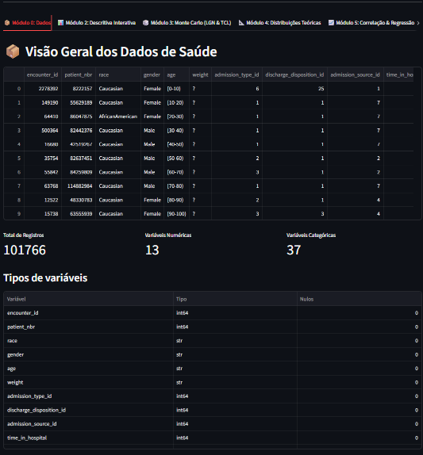
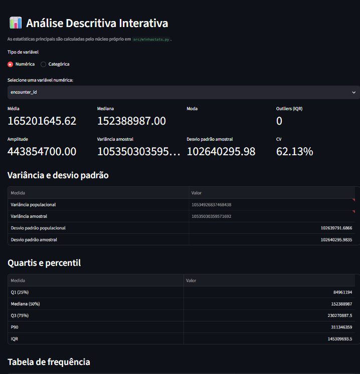
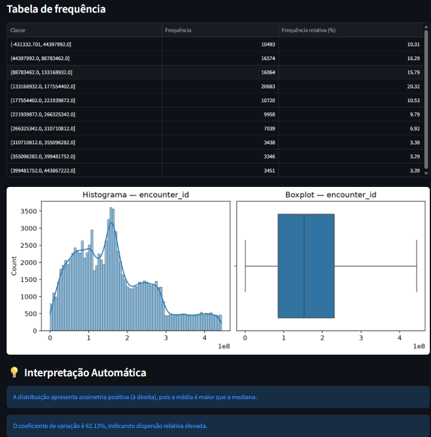
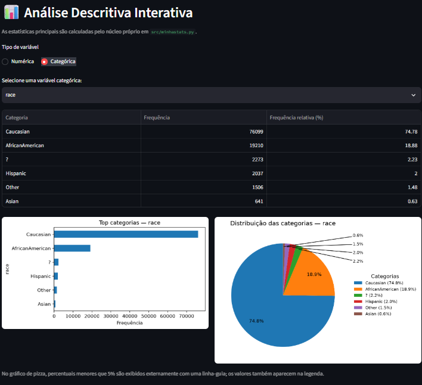
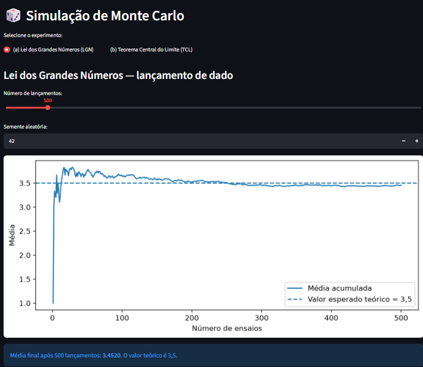
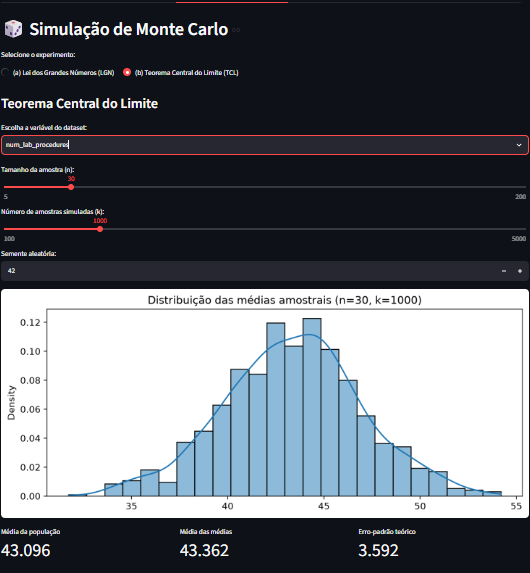
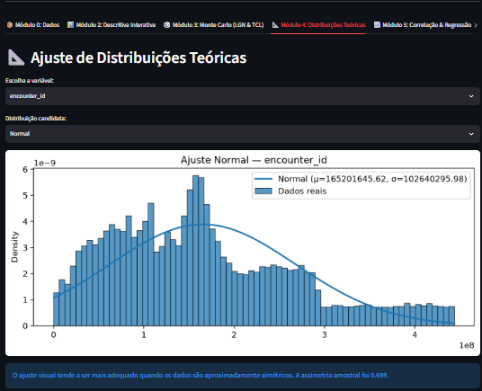
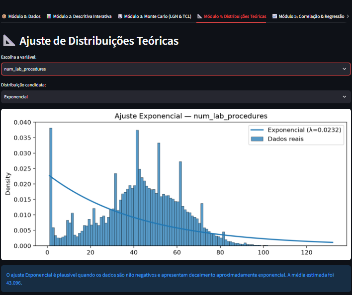
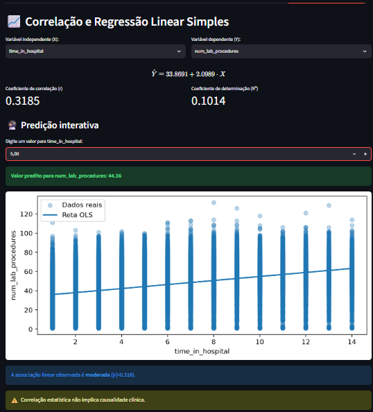
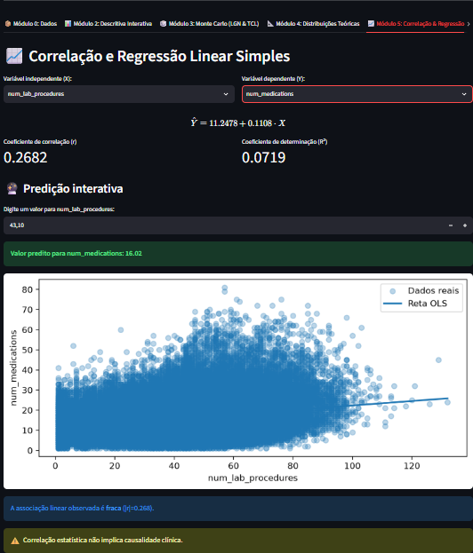

# 🩺 Laboratório Estatístico Interativo — Análise de Dados de Saúde

Aplicação web interativa desenvolvida em **Python + Streamlit** para análise estatística descritiva, simulação de probabilidade, ajuste de distribuições teóricas, correlação e regressão linear aplicada a dados de saúde.

## 👥 Identificação

- **Aluno:** João Marcos de Barcelos Fernandes
- **Matrícula:** 72650311
- **Disciplina:** [Matemática e Estatística para Computação](https://campusonline1.ceub.br/course/view.php?id=2382)
- **Projeto:** Laboratório Estatístico Interativo

## 🎯 Objetivo

Construir um laboratório estatístico interativo capaz de carregar um dataset real de saúde e aplicar cálculos estatísticos próprios, validação numérica, visualizações e experimentos de Monte Carlo.

A aplicação está organizada nos seguintes módulos:

- **Módulo 0 — Dados:** inspeção inicial, quantidade de registros, tipos de variáveis e valores ausentes.
- **Módulo 1 — Núcleo Estatístico:** biblioteca própria em `src/minhastats.py`, sem usar NumPy/SciPy para os cálculos fundamentais.
- **Módulo 2 — Estatística Descritiva:** tendência central, dispersão, quartis, percentis, frequência, outliers e interpretação automática.
- **Módulo 3 — Monte Carlo:** Lei dos Grandes Números e Teorema Central do Limite.
- **Módulo 4 — Distribuições Teóricas:** ajustes Normal e Exponencial sobre o histograma dos dados.
- **Módulo 5 — Correlação e Regressão:** Pearson, regressão linear por mínimos quadrados, R² e predição.
- **Módulo 6 — Descobertas:** três interpretações estatísticas calculadas a partir do dataset.

## 🗃️ Dataset

### Diabetes 130-US Hospitals for Years 1999-2008

O projeto utiliza o dataset público **Diabetes 130-US Hospitals for Years 1999-2008**, disponibilizado pelo **UCI Machine Learning Repository**.

- **Fonte original:** UCI Machine Learning Repository
- **URL original:** https://archive.ics.uci.edu/dataset/296/diabetes+130+us+hospitals+for+years+1999-2008
- **Registros:** 101.766
- **Atributos:** 47
- **Domínio:** saúde hospitalar / diabetes

O conjunto possui variáveis numéricas e categóricas suficientes para os requisitos de exploração descritiva, simulação, distribuições, correlação e regressão.

### Download reproduzível

Os dados brutos não são versionados no Git por segurança e reprodutibilidade. O script abaixo baixa o pacote original diretamente do UCI e extrai o CSV esperado para `data/raw/`:

```bash
python scripts/download_dataset.py
```

Depois disso, a aplicação encontra automaticamente o CSV em `data/raw/`.

## 🛠️ Tecnologias

- Python 3.10+
- Streamlit
- Pandas
- NumPy
- SciPy
- Matplotlib
- Seaborn
- Pytest

As versões utilizadas estão fixadas em `requirements.txt`.

## 🚀 Instalação e execução

### 1. Clonar o repositório

```bash
git clone https://github.com/Jota0404/laboratorio-estatistico-saude.git
cd laboratorio-estatistico-saude
```

### 2. Criar ambiente virtual

Windows:

```bash
python -m venv .venv
.venv\Scripts\activate
```

Linux/macOS:

```bash
python3 -m venv .venv
source .venv/bin/activate
```

### 3. Instalar dependências

```bash
pip install -r requirements.txt
```

### 4. Baixar o dataset

```bash
python scripts/download_dataset.py
```

### 5. Executar o laboratório

```bash
streamlit run app.py
```

O Streamlit exibirá o endereço local da aplicação no terminal.

## 🧪 Testes automatizados

Execute:

```bash
pytest
```

A suíte valida o núcleo próprio contra resultados de referência do NumPy/SciPy e cobre casos de borda, incluindo dados vazios, tamanhos incompatíveis, variância zero, quantis inválidos, variância populacional/amostral e coeficiente de variação.

## 📐 Núcleo Estatístico Próprio

O arquivo `src/minhastats.py` implementa, em Python puro:

- Média
- Mediana
- Moda
- Amplitude
- Variância populacional
- Variância amostral
- Desvio padrão populacional
- Desvio padrão amostral
- Quartis e percentis
- Coeficiente de variação
- Covariância
- Correlação de Pearson
- Regressão linear simples por mínimos quadrados

As bibliotecas NumPy e SciPy são usadas na suíte de testes e nas ferramentas de visualização/ajuste, mas os cálculos fundamentais solicitados no núcleo são implementados no módulo próprio.

## 📊 Validação

Os testes comparam as funções próprias com implementações de referência:

- `numpy.mean`
- `numpy.median`
- `numpy.var`
- `numpy.std`
- `numpy.percentile`
- `numpy.cov`
- `scipy.stats.pearsonr`
- `scipy.stats.linregress`

A tolerância numérica é definida individualmente nos testes conforme a operação.

## 📷 Evidências da aplicação

As capturas abaixo foram obtidas durante a validação manual da aplicação e devem ficar no diretório `docs/screenshots/` do repositório.

### Módulo 0 — Dados



### Módulo 2 — Estatística Descritiva







### Módulo 3 — Monte Carlo





### Módulo 4 — Distribuições Teóricas





### Módulo 5 — Correlação e Regressão





## 📄 Relatório

O relatório técnico/acadêmico está em [`RELATORIO.md`](RELATORIO.md) e documenta o dataset, decisões de implementação, fórmulas, validação, módulos e descobertas estatísticas.

## 📁 Estrutura

```text
laboratorio-estatistico-saude/
├── app.py
├── README.md
├── RELATORIO.md
├── requirements.txt
├── .gitignore
├── data/
│   └── raw/
├── docs/
│   └── screenshots/
├── scripts/
│   └── download_dataset.py
├── src/
│   ├── __init__.py
│   └── minhastats.py
└── tests/
    └── test_minhastats.py
```

## 🔐 Dados e LGPD

O repositório não versiona CSVs brutos de saúde. O dataset utilizado é público e obtido da fonte acadêmica indicada acima. O `.gitignore` mantém arquivos CSV locais fora do controle de versão.

## 🎥 Vídeo demonstrativo

O vídeo demonstrativo não será produzido pelo autor desta entrega. Os demais requisitos de implementação, documentação e evidências são atendidos conforme o escopo desta entrega.
